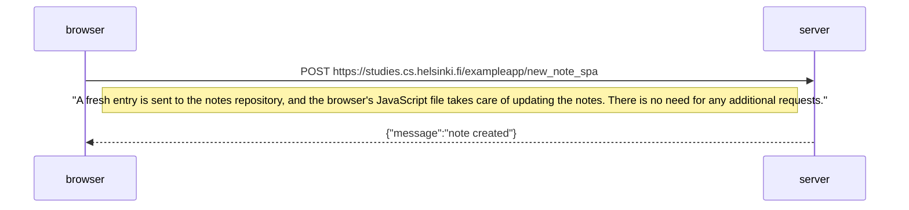

```mermaid

sequenceDiagram
    participant browser
    participant server

    browser->>server: POST https://studies.cs.helsinki.fi/exampleapp/new_note_spa

    Note right of browser: "A fresh entry is sent to the notes repository, and the browser's JavaScript file takes care of updating the notes. There is no need for any additional requests."

    server-->>browser: {"message":"note created"}


```